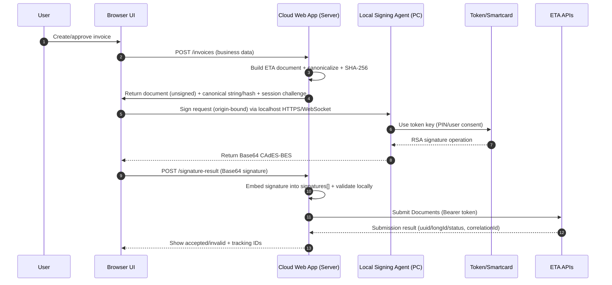
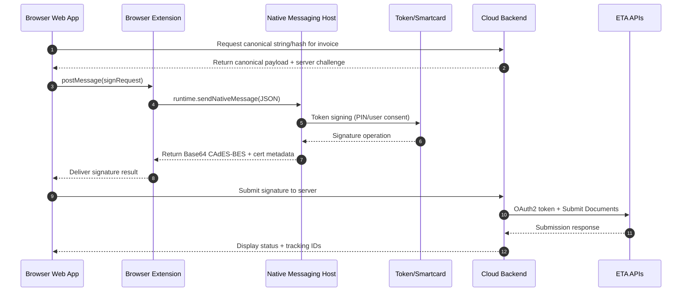

# Client-Side Hardware-Token Document Signing for Egypt ETA Portal in Cloud Web Applications

## Executive summary

A cloud web application can integrate with Egypt’s eInvoicing/eReceipt ecosystem operated by the entity["organization","Egyptian Tax Authority","tax authority, egypt"] by generating an invoice/receipt document (JSON or XML), canonicalizing it using ETA’s specified serialization algorithm, and producing a **CAdES-BES** (CMS-based) signature using the signer’s **e-Seal (E-Sealing) certificate** stored on a **USB token / smartcard** (or, at higher throughput, an HSM). citeturn24view0turn0search0turn2view0turn17view3

ETA’s own published validation rules and supporting documentation are unusually explicit: the signature must be **Base64-encoded** CAdES-BES, must include specific signed attributes (including **SigningCertificateV2 / ESSCertIDv2**), must avoid embedding content (“encapsulated data not allowed”), and must **not** use higher CAdES levels like **CAdES-T** (timestamped) or **CAdES-XL**. citeturn18view0turn18view1turn4view2turn4view3turn4view4

From a browser, directly accessing a user’s existing smartcard/token keys is generally **not feasible** using pure web APIs (WebCrypto/WebAuthn/WebUSB/WebHID) in a way that yields an ETA-valid CAdES-BES with the taxpayer’s accredited X.509 certificate. Instead, the dominant and most supportable pattern—also reflected by official Egyptian tooling for portal signing—is a **local native helper** (“signing agent”) invoked from the web app, typically via **browser extension + native messaging**, or via a hardened **localhost HTTPS/WebSocket** channel. citeturn11view0turn32search3turn32search11turn29search24turn29search37

A robust recommended architecture is therefore: cloud app builds + canonicalizes document → browser requests a **local signer** to create CAdES-BES using the token (PKCS#11 / OS token frameworks) → cloud app embeds returned Base64 signature into `signatures[]` and submits documents to ETA APIs using **OAuth 2.0 client-credentials** against ETA Identity Service, observing rate limits and standard headers. citeturn35view0turn35view1turn34view0turn24view0turn0search0

## ETA portal signing requirements and accepted signature standards

### Document types, where signatures live, and what is actually signed

ETA’s official SDK defines invoice documents (and related document types) where a `signatures` array is mandatory for submission; **at least the Issuer signature must be present**, while a Service Provider signature is optional. The signature object includes a `type` (Issuer “I”, ServiceProvider “S”) and a `value` that is a **Base64 string** containing the **CAdES-BES** structure. citeturn24view0

The signing process for ETA eInvoicing/eReceipt is not “sign the JSON bytes as-is.” ETA specifies a deterministic **canonical serialization** of the document’s significant fields (names + values) so that minor whitespace/newline changes during transport do not alter the signed value. citeturn0search0turn2view0

ETA’s signature creation guide specifies the overall flow:

1. Create document JSON or XML **without** signature.
2. Produce canonical version using ETA’s serialization algorithm.
3. Apply **SHA-256** to the canonical string bytes (UTF‑8).
4. Sign using **CAdES-BES**.
5. Embed Base64 signature back into the document, then submit. citeturn0search0

ETA’s document structure guidance further clarifies signature scoping: the issuer signature covers the entire document **except** the signature section, and the service-provider signature (if used) includes the issuer signature. citeturn24view0

### Canonicalization and hashing requirements (ETA-specific)

ETA’s “Document Serialization Approach” specifies key normalization and ordering rules including: property names uppercased invariantly, values preserved exactly as represented (e.g., `0.0` must remain `0.0`), quoting rules, array prefixing rules (differ between JSON and XML), and escaping of quotes in XML values. citeturn2view0

This serialization step is **load-bearing**: any discrepancy between client/agent/server implementations will yield a different hash and therefore an invalid signature when ETA validates. citeturn0search0turn2view0turn18view0

### Required CAdES/CMS profile and disallowed variants

ETA’s official validation library documentation indicates strict enforcement of **CAdES-BES only**:

- “Encapsulated data in the signature is not allowed.”
- “CAdES–T signature is not allowed … Only valid CAdES-BES format is allowed.”
- “CAdES–C / X / XL … not allowed.”
- “CMS Signature is not allowed … Only valid CAdES-BES.” citeturn18view0turn18view1

This is consistent with the ETA/ITIDA “Digital Signature Format for E‑Invoice System” document describing a **CAdES Basic Electronic Signature (CAdES‑BES)** profile expected by the ITIDA validation module integrated into ETA e‑Invoice. citeturn4view0turn4view2turn4view3turn14search3

From standards perspective:

- **CMS** is defined in IETF RFC 3852 / RFC 5652. citeturn36search0turn36search3  
- **CAdES** (CMS Advanced Electronic Signatures) is profiled in RFC 5126. citeturn36search1  
- The required **SigningCertificateV2 / ESSCertIDv2** attribute is defined in RFC 5035. citeturn36search2  

ETA’s “Digital Signature Format” specifies the signature algorithm as **sha256WithRSAEncryption** and SHA‑256 as the hashing algorithm for message digest and cert hashing, implying that for ETA compliance you should assume **RSA + SHA‑256** unless ETA publishes newer profiles. citeturn4view4turn4view5

### Certificate requirements and trust chain constraints

ETA’s ecosystem is bound to Egypt’s regulated digital signature environment overseen by the entity["organization","Information Technology Industry Development Agency","digital signature regulator, egypt"], per Law No. 15 of 2004, as described in ITIDA materials. citeturn9view0turn14search0

ITIDA’s public guidance describes issuing and activating **digital signature tokens** and **electronic seal** tools via ITIDA-licensed service providers. citeturn14search0turn7view2

ETA’s validation library error codes show that certificate trust is evaluated and must chain to an **Egypt Root CA** (“Certificate should be signed from Egypt Root CA”; “certificate chain doesn’t reach Egypt Root CA”). It also indicates revocation checking via **OCSP and/or CRL** is part of validation logic (multiple OCSP/CRL failure codes). citeturn18view1turn18view2

Multiple ETA documents connect the e-seal certificate to taxpayer identity:

- Self-registration guide: taxpayer must possess a digital signature with an **E-Seal certificate** containing the taxpayer’s **Tax Registration ID**, and (notably) the process “works only on machines with Windows OS” (for that specific portal workflow). citeturn22view0  
- E-Seal solution overview: e-sealing certificates include a Tax ID field to differentiate taxpayer companies. citeturn17view0  
- Signature validation rules in the SDK: signing certificate must be issued to the issuer (taxpayer registration number in certificate matches the document) and/or an active representative; signature must be RSA and created using an approved certificate in Egypt. citeturn24view0  

### Timestamping and long-term validation

Because ETA explicitly rejects **CAdES-T** and higher CAdES levels, you should assume that **embedded RFC 3161 timestamps inside the CAdES object are not accepted** even if they would be standard in other AdES ecosystems. citeturn18view0turn18view1turn36search1

ETA/ITIDA’s profile expects the CMS **SigningTime** signed attribute and can fail validation if signature time is missing (“Verification failed because signature doesn’t contain signature time”). citeturn18view0turn4view4

Operationally, the ETA submission timestamp and API audit trail become important compensating evidence, because the signature itself is restricted to BES level. citeturn34view0turn35view1turn18view0

### Transport and endpoint constraints (ETA APIs)

ETA’s SDK describes API-level integration constraints:

- Authentication is via **OAuth 2.0 client credentials** against the **Identity Service** (token endpoint `POST /connect/token`), with `Authorization: Basic` client credentials and response token lifetime (example: 3600 seconds). citeturn35view0turn36search1  
- Standard API headers include `Authorization: Bearer <token>`, language negotiation (`Accept-Language` supports “en”/“ar”), and rate-limit headers such as `X-Rate-Limit-*`, plus `correlationId` for tracing. citeturn35view1  
- Pre-production environments rely on internally issued certificates and require trusting a root CA in test environments; ETA lists distinct base URLs for Registration Portal, Invoicing Portal, System API, and Identity Service. citeturn25view0  
- Example throttling: for Search Documents API, “current configuration is 1 request every 2 seconds” (subject to change). citeturn34view0  

## Methods to access local tokens from a browser

### Why “pure browser” approaches rarely meet ETA’s requirement

ETA requires a CAdES-BES signature that embeds the signer’s X.509 certificate and specific CMS/CAdES attributes (notably ESSCertIDv2 / SigningCertificateV2). citeturn24view0turn4view2turn18view0

Most browser cryptography APIs either:
- do not have any standardized way to call into an existing smartcard/token’s private key, or
- can sign only via keys created under a different trust model (e.g., WebAuthn credentials), producing signatures that are not easily wrapped into ETA’s mandated CAdES-BES structure tied to an ITIDA-accredited certificate. citeturn29search37turn32search2turn36search1

### WebCrypto

The Web Crypto API provides cryptographic primitives (digest, sign, verify, etc.) to script, but it is not a token access API and does not standardize using a resident key on a smartcard/HSM via PKCS#11 or OS token frameworks. citeturn29search37

Implication for ETA: WebCrypto may be used for **canonicalization hashing** (SHA‑256) on the client if desired, but not for using the taxpayer’s existing eSeal private key on a token in a cross-browser way. citeturn0search0turn29search37turn33search30

### WebAuthn (passkeys / FIDO2)

WebAuthn defines creation and use of scoped public-key credentials stored by an authenticator at the behest of a relying party origin, subject to user consent. The resulting assertion includes a signature produced by that credential’s private key. citeturn32search2turn32search22

However, WebAuthn keys are not generally the same as ITIDA-issued eSeal certificates on PKI tokens, and WebAuthn does not natively output a CMS/CAdES structure with the certificate chain and required signed attributes. For ETA interoperability, WebAuthn is best viewed as an **authentication** mechanism, not a compliant eInvoice/eReceipt signing mechanism. citeturn32search2turn24view0turn4view2

### WebUSB and WebHID

WebUSB provides a web platform API to access USB devices securely from web pages, while WebHID provides access to HID devices from the browser. citeturn32search12turn32search1

Practical constraints for smartcards/tokens:

- Most signature tokens are not designed as “web-connected” devices; they typically expose cryptographic operations through **PKCS#11**, **PC/SC**, or OS token frameworks, not a web-friendly command protocol. citeturn33search30turn31search2turn33search1  
- WebUSB/WebHID introduce meaningful security risk if misused; vendor advisories discuss weaknesses in the assumption of OS-exclusive HID access across platforms. citeturn32search31turn32search12  
- Browser and platform support is uneven, and enterprise environments may block these APIs. citeturn32search16turn32search13  

Therefore, for ETA-grade signing with existing PKI smart tokens, WebUSB/WebHID are typically **not recommended** except for very specialized hardware designed explicitly for a web protocol. citeturn33search30turn32search31turn24view0

### Native helper apps, browser extensions, and middleware

This is the dominant approach for PKI token signing on the web:

- A **native signing agent** runs locally and can access the token via:
  - PKCS#11 (cross-platform: PKCS#11 modules and discovery via p11-kit), citeturn33search30turn33search2turn33search13  
  - Windows Smart Card KSP / minidrivers (CNG/CAPI), citeturn33search0  
  - macOS CryptoTokenKit, citeturn33search1turn33search5  
  - Linux PC/SC (pcsc-lite) + token middleware. citeturn31search2turn31search3  

- The browser communicates with the agent via:
  - **Browser extension + Native Messaging** (Chrome/Chromium and Firefox both document this pattern), citeturn32search3turn32search11  
  - A hardened **localhost** HTTPS/WebSocket service with strict origin checks and per-session authorization (works without extension but is harder to secure well). citeturn28view0turn32search19  

Notably, Egyptian ecosystem tooling itself includes an ITIDA “Web‑Sign Client” desktop application installed on the user machine to perform signing “through portal using smart token,” with browsers prompting the user to open the signing client after pressing “Sign.” citeturn11view0turn11view1turn13view1  
This strongly validates the helper-app pattern as compatible with Egyptian operational expectations, even though the published ITIDA client is Windows-focused. citeturn11view0turn22view0

## Open-source projects and libraries relevant to ETA-compatible token signing

### Comparison table of candidate projects

The table below focuses on open-source components that help you (a) talk to tokens/smartcards, (b) create/validate CMS/CAdES signatures, and (c) implement the browser↔local signing bridge.

| Project | Primary role | Language | License | Platforms | Token / standard support | Maturity signals | Why it matters for ETA |
|---|---|---:|---:|---|---|---|---|
| OpenSC | Smartcard/token middleware | C | LGPL 2.1+ | Win/Linux/macOS | PKCS#11, Windows minidriver, macOS Tokend/CryptoTokenKit ecosystem | Actively maintained; broad adoption | Often the bridge that makes smartcards/tokens usable via PKCS#11 across OSes. citeturn29search0turn31search31turn31search3 |
| pcsc-lite | PC/SC runtime for smartcards (Linux/Unix) | C | BSD-like (core) | Linux/Unix | SCard API layer for readers/tokens | Long-lived project | Common foundation for Linux smartcard access. citeturn31search2 |
| p11-kit | PKCS#11 module discovery/proxy | C | (project-specific; widely packaged) | Linux/Unix | Enumerates/coordinates PKCS#11 modules; proxy module | Widely used in Linux distros | Helps avoid hardcoding PKCS#11 module paths; improves ops reliability. citeturn33search2turn33search13 |
| libp11 / OpenSSL pkcs11 engine | OpenSSL ↔ PKCS#11 bridge | C | (OpenSC ecosystem) | Linux/Unix primarily | OpenSSL engine for PKCS#11 modules | Mature; used in many guides | Useful for debugging and some signing workflows; may not natively emit ETA’s exact CAdES-BES attributes without extra work. citeturn31search1turn33search30turn18view0 |
| SoftHSM2 | Software PKCS#11 token (dev/test) | C | BSD‑2‑Clause | Linux; builds exist for Win | PKCS#11 interface simulation | Widely used | Critical for CI testing of PKCS#11 integration without physical tokens. citeturn31search0turn31search4 |
| pkcs11js | Direct PKCS#11 access in Node | Node/C++ | (PeculiarVentures ecosystem; MIT indicated) | Win/Linux/macOS | PKCS#11 2.40 API | Active ecosystem | Enables a Node-based local agent to sign using token keys. citeturn29search1turn29search33turn33search30 |
| node-webcrypto-p11 | WebCrypto polyfill over PKCS#11 | TypeScript | MIT | Win/Linux/macOS | WebCrypto-like API backed by PKCS#11 | Popular in PKCS#11 JS space | Lets a local agent expose a WebCrypto-like signing interface over token keys. citeturn29search6turn29search2 |
| webcrypto-local | Secure local service exposing PKCS#11 | TypeScript | MIT | Cross-platform | PKCS#11 access over “webcrypto-socket”; includes security policy | Designed for exactly this bridge | A ready-made “local agent” concept you can adapt rather than inventing wire security from scratch. citeturn29search25 |
| Pkcs11Interop | .NET wrapper for PKCS#11 | C# | Apache‑2.0 | Win/Linux/macOS | PKCS#11 modules, cert store helpers | Mature; active | Enables a cross-platform .NET signer agent using PKCS#11 vendor/OpenSC modules. citeturn29search7turn29search3 |
| DSS (Digital Signature Service) | Create/extend/validate AdES (CAdES/PAdES/XAdES/…) | Java | LGPL 2.1 | Cross-platform (Java) | CAdES/PAdES/XAdES, OCSP/CRL handling | Backed by EU building blocks | Useful if you want a high-level signing/validation stack; may require adaptation to ETA’s “CAdES-BES only” constraints. citeturn30search0turn30search8turn18view0 |
| Bouncy Castle | Low-level crypto + CMS building blocks | Java/.NET | Bouncy Castle License (MIT-like) | Cross-platform | CMS (RFC 3852/5652), can build ESS attributes | Very widely used | Strong choice when you must precisely control CMS attributes to satisfy ETA’s strict profile. citeturn30search1turn36search0turn36search2 |
| JSignPdf | PDF signing tool | Java | LGPL/MPL (project docs) | Win/Linux/macOS | Primarily PAdES/PDF signing | Mature but PDF-focused | Helpful only if you also sign PDFs internally; ETA eInvoice submission is JSON/XML signature, not PDF. citeturn30search10turn30search26turn37search3 |
| LibreSign | Document signing platform (mostly PDF workflows) | PHP (Nextcloud app) | AGPL‑3.0 | Server-side app | e-sign platform | Active | Not tailored to ETA; relevant as reference for workflow UX and document signing management, not for ETA CAdES-BES eInvoice. citeturn30search15turn30search11 |

### Egypt-specific open-source implementations and patterns

These projects are particularly valuable as “local precedent” for ETA signing flows and integration ergonomics:

- **mrkindy/ETAHttpSignature**: a Windows-oriented helper that signs by exposing a local **WebSocket** endpoint (`ws://localhost:18088`) returning `{cades:"…"}` and is MIT-licensed. This mirrors the architecture you described (cloud web app triggers local token signing). citeturn28view0turn38search3  
- **mrkindy/EgyptianEInvoice** (PHP SDK, MIT) includes a front-end snippet creating a WebSocket to `ws://localhost:18088`, then sending a document serialization string and certificate issuer name, and finally sending the signature in the document payload. citeturn27view3turn28view0  
- **AH3laly/Egypt-ETA-E-Invoice-Signer** describes a command-line tool that reads invoice JSON, generates canonical string, produces CAdES, and outputs a fully signed JSON document; this is useful for troubleshooting canonicalization/signature mismatches. (The repository page does not clearly present an open-source license in the visible metadata; treat as “license unclear” unless verified.) citeturn38search1  
- **mostafaism1/eta-einvoice-signer** is a Java web app that supports “hardware token keystore” (PKCS#11 config) and “file-based keystore” (PKCS#12) in configuration, but its issue tracker includes “Use an open source license” as an open issue, suggesting licensing may be unresolved—treat cautiously for production reuse. citeturn38search2turn38search6turn37search0  
- **ahmadabousetta/Egypt-tax-invoice-api** is sample code to upload CAdES-BES signed invoices; the visible repo metadata doesn’t clearly state a license. It is useful as reference code, but you should confirm licensing before reuse. citeturn38search0  

## Integration architectures and implementation options

This section proposes architectures that satisfy your constraint: **cloud web app triggers a signature operation on the user’s machine using the local token**, then submits to ETA.

### Architecture option: Cloud app + local signing agent (loopback HTTPS/WebSocket)

This is the most straightforward path (no extension required), but it must be secured carefully.

**High-level steps**

1. Cloud backend builds the unsigned ETA document (JSON/XML) according to SDK schema. citeturn24view0turn38search15  
2. Cloud backend canonicalizes using ETA algorithm and computes SHA‑256 (optionally provide canonical string to the client; your choice). citeturn2view0turn0search0  
3. Browser connects to `https://127.0.0.1:<port>` or `ws://127.0.0.1:<port>` and requests signing with:
   - canonical string (or canonical hash + a “sign-hash” mode that preserves ETA’s `messageDigest` semantics), plus
   - certificate selection hint (issuer name / subject), plus
   - a one-time session challenge binding the request to your site origin. citeturn24view0turn18view0turn35view1  
4. Local agent loads the token (PKCS#11 or OS framework), prompts for PIN / user consent, creates **CAdES-BES** per ETA/ITIDA profile, returns Base64 signature. citeturn33search30turn33search0turn33search1turn18view0turn4view2  
5. Cloud backend embeds signature into `signatures[]`, then submits the document batch to ETA via `Submit Documents` API using OAuth 2.0 access token. citeturn24view0turn35view0turn38search15  

**Mermaid sequence diagram**



This matches real-world Egypt-focused examples that expose `ws://localhost:18088` and return `{cades:"…"}` to the browser. citeturn28view0turn27view3

**Packaging signed output for ETA**

For invoices, ETA’s structure indicates:

```json
{
  "documents": [
    {
      "documentType": "i",
      "documentTypeVersion": "1.0",
      "...": "...",
      "signatures": [
        { "type": "I", "value": "BASE64_CADES_BES_DER" }
      ]
    }
  ]
}
```

The signature `value` must be the Base64 encoding of the binary ASN.1 CAdES-BES structure; issuer signature is required. citeturn24view0turn0search0turn18view0

### Architecture option: Browser extension + native messaging host (recommended for security)

This reduces the attack surface compared with a generic localhost server, because the web page does not talk to the native binary directly; it talks to an extension, which talks to a registered native host.

Chrome’s Native Messaging documentation describes the model, including `allowed_origins` controls and stdio-based messaging. citeturn32search3  
Mozilla documents the analogous concept for WebExtensions. citeturn32search11

**Mermaid sequence diagram**



**Why this usually wins**

- Better isolation from arbitrary websites trying to call your local signer (a common localhost risk), because only your extension can reach the native host via `allowed_origins`. citeturn32search3turn32search11turn32search19  
- More controllable UX and permission prompts.
- Easier to implement strict allowlisting and authenticated message framing.

### Architecture option: “Pure web API” hardware access (generally not recommended)

A theoretical path is:
- use WebUSB/WebHID to talk directly to a token,
- implement token APDUs/CCID or vendor protocol in JS,
- do RSA signing and wrap CAdES attributes in JS.

For ETA, this is typically impractical because:
- tokens are not accessed as generic USB peripherals; they’re mediated by OS smartcard stacks and PKCS#11 providers, citeturn31search2turn33search30  
- WebUSB/WebHID introduce significant security considerations and inconsistent OS behavior. citeturn32search12turn32search31turn32search1  

If you ever go down this route, it should be for hardware explicitly designed for browser access—not general eSeal smart tokens.

### Architecture option: Hybrid approaches (often necessary in production)

Common hybrids:

- **Server canonicalizes, client signs**: avoids re-implementing ETA serialization logic in multiple places and allows you to maintain one canonicalization implementation. citeturn2view0turn0search0  
- **Client canonicalizes, client signs**: reduces “invoice data” round-trips to the server at signing time, but increases the risk of canonicalization drift across clients. citeturn2view0turn18view0  
- **Dual mode token/HSM**: ETA materials distinguish “smart token” (<~2 signatures/sec) versus HSM (thousands/sec) selection by transaction volume. Even if your immediate requirement is “user device token,” some enterprises will demand an HSM path for high throughput. citeturn20view0turn20view1turn17view1  

## Security, compliance, and forensic considerations

### Key protection and user consent

Egypt’s ecosystem expects private keys to remain protected inside hardware tokens/HSMs (keys generated inside token; “highly secured as part of the HW token”), with signing gated by PIN. citeturn20view0turn11view2turn14search0

Your local signer should enforce:
- explicit user action (click “Sign”),
- certificate selection confirmation (especially if multiple certs exist on token), citeturn11view2turn22view1  
- PIN entry through OS-provided secure UI when possible (Windows Smart Card UI prompt is shown in ITIDA examples). citeturn11view2turn33search0  

### Securing the browser ↔ local agent channel

If you use a localhost server without an extension, defend against cross-site request abuse:

- Enforce strict origin checks (validate `Origin` header for WebSocket; implement an allowlist).  
- Require a session-bound challenge issued by your cloud backend and verified by the local agent (prevents arbitrary sites from getting signatures).  
- Prefer `127.0.0.1` and random high ports; avoid exposing on LAN.  
- Consider mutual authentication between browser context and agent (extension-native messaging provides this more naturally). citeturn32search3turn32search19turn28view0  

If you use an extension + native messaging host:
- Use `allowed_origins` in the native host manifest. citeturn32search3  
- Validate message schema and size; never accept “sign arbitrary bytes” without showing the user what they are signing.  
- Treat the extension as part of your trusted computing base; follow extension security guidance. citeturn32search34turn32search23  

### TLS and secrets

ETA API access is controlled by OAuth2 client credentials; your cloud backend must protect `client_secret` and never expose it to the browser. citeturn35view0turn35view1

ETA pre-production requires installing a test root CA to trust its TLS endpoints; this should never be installed in production machines. citeturn25view0

### Signature compliance checks and audit logging

Given ETA’s strict validation failures (e.g., “encapsulated data not allowed,” “CAdES-T not allowed,” “signing time missing”), build a robust compliance toolchain:

- Locally parse the returned CAdES/CMS and verify:
  - SignedAttributes include `contentType`, `messageDigest`, `signingTime`, and SigningCertificateV2 (ESSCertIDv2). citeturn4view2turn4view4turn18view0turn36search2  
  - No eContent is embedded (detached). citeturn18view0turn4view3  
  - Signature algorithm is RSA + SHA‑256 where required by the profile. citeturn4view5turn24view0  
- Validate the signer certificate chain and revocation info the same way ETA is likely to do (OCSP/CRL); ETA’s validation library explicitly errors when OCSP/CRL checks fail or the chain doesn’t reach Egypt Root CA. citeturn18view1turn18view2  
- Persist evidence for dispute resolution:
  - canonical string hash,  
  - signature Base64 + decoded DER bytes hash,  
  - signer cert subject/serial and chain fingerprints,  
  - ETA API `correlationId`, `uuid`, `longId`, submission status. citeturn35view1turn34view0turn24view0  

### Egypt legal/regulatory alignment (high-level)

ITIDA describes its regulatory oversight and licensed providers for digital signature and electronic seal services, including token issuance procedures. citeturn14search0turn9view0turn7view2

This implies your production deployment should assume:
- certificates and tokens come from **ITIDA-licensed CSPs**, citeturn14search0turn7view2  
- certificate identity attributes (e.g., taxpayer registration) must match ETA-submitted document identity fields, citeturn24view0turn22view0  
- you will likely need operational procedures for lost token revocation and re-issuance, aligned with ITIDA guidance. citeturn14search0turn18view1  

## Implementation checklist, recommended stacks, and estimated effort

### Key assumptions (explicit)

- “ETA portal” refers to ETA’s **eInvoicing/eReceipt** submission and portal workflows described in the ETA SDK and published ITIDA/ETA documents. citeturn38search18turn25view0turn15view0  
- The required signature is the ETA-mandated **CAdES-BES** embedded in document JSON/XML, not a visible PDF signature. citeturn24view0turn18view0  
- Token type, OS distribution, and programming language are open-ended; the design therefore emphasizes portability via PKCS#11 and OS token frameworks. citeturn33search30turn33search0turn33search1  

### Implementation checklist (practical and ETA-specific)

- Confirm which ETA document types you will submit (invoice, credit/debit, receipts) and implement schema validation from the SDK. citeturn24view0turn38search15  
- Implement ETA canonicalization exactly (write golden tests using ETA’s JSON/XML examples and verify hash outputs). citeturn2view0turn0search0  
- Implement CAdES-BES generation with explicit control of:
  - required signed attributes including SigningCertificateV2 (ESSCertIDv2), citeturn4view2turn36search2  
  - detached signature (no encapsulated eContent), citeturn18view0turn4view3  
  - prohibition of CAdES-T/C/X/XL levels. citeturn18view0turn18view1  
- Build local agent token access:
  - PKCS#11 module selection and discovery (p11-kit on Linux; vendor/OpenSC modules), citeturn33search13turn33search2turn31search3  
  - Windows Smart Card KSP/minidriver fallback when PKCS#11 isn’t available, citeturn33search0turn31search31  
  - macOS CryptoTokenKit support where appropriate. citeturn33search1turn33search5  
- Implement browser↔agent bridge (prefer extension + native messaging) and lock down allowed origins. citeturn32search3turn32search11  
- Implement server-side ETA integration:
  - OAuth2 token retrieval (`/connect/token`), token caching/renewal, citeturn35view0  
  - standard headers and correlationId logging, citeturn35view1  
  - rate limiting/backoff. citeturn34view0  
- Add end-to-end validation gates before submission:
  - parse returned Base64 signature, ensure it matches ETA allowed profile, citeturn18view0turn18view1turn4view2  
  - verify certificate chain and (optionally) OCSP/CRL to catch issues early. citeturn18view1turn18view2  

### Recommended stacks

**Primary recommendation (most balanced for security + portability)**  
Browser extension + native messaging host + cross-platform signer:

- **Native signer**: .NET 8 (self-contained) using **Pkcs11Interop** for PKCS#11 access and a CMS/CAdES library (e.g., Bouncy Castle for .NET or a tightly controlled CMS builder) to emit ETA-compliant CAdES-BES with required attributes. citeturn29search7turn36search0turn36search2turn18view0  
- **Token access**: Prefer PKCS#11; rely on OpenSC/p11-kit where appropriate; support Windows Smart Card KSP as fallback. citeturn33search30turn31search31turn33search0turn33search13  
- **Browser bridge**: Chrome/Chromium and Firefox native messaging. citeturn32search3turn32search11  
- **Cloud backend**: canonicalizes + submits to ETA using OAuth2 client credentials. citeturn35view0turn0search0  

Why: This provides strong origin control, avoids exposing a generic localhost signing port, and maps cleanly to ETA’s strict profile enforcement. citeturn18view0turn32search3turn32search19  

**Alternative A (fastest to prototype; more localhost risk)**  
Local agent exposing hardened WebSocket/HTTPS (similar to Egypt-specific examples):

- Start from the `ws://localhost:18088` pattern in **ETAHttpSignature** and harden it with origin allowlists + session challenges. citeturn28view0turn32search19  
- Use this as a PoC to prove end-to-end signature validity quickly, then migrate to extension/native messaging. citeturn11view0turn28view0  

**Alternative B (Java-first signing correctness)**  
Java local agent using DSS or Bouncy Castle:

- Use **DSS** (Java, LGPL 2.1) for high-level signature creation/validation and AdES utilities, but constrain output to ETA-allowed CAdES-BES only. citeturn30search0turn30search8turn18view0  
- Access tokens via Java’s PKCS#11 capabilities plus vendor modules/OpenSC. citeturn33search30turn31search3  
- Package with a bundled JRE to avoid requiring a user-installed JVM.

### Estimated effort and key risks (engineering estimates)

Effort (typical for a small team; adjust to your org constraints):

- Proof-of-concept (Windows-first, one token model, end-to-end submit): ~2–4 weeks. (Estimate based on complexity of strict CAdES-BES profile + local agent + ETA API integration; ETA’s strict validation rules increase iteration time.) citeturn18view0turn35view0turn0search0  
- Production-ready cross-platform agent + extension hardening + audit tooling: ~6–12 weeks.

Key risks:

- **Token driver availability on Linux/macOS**: some CSP-issued tokens may have stronger Windows support; verify which PKCS#11 modules/minidrivers exist for your target token/CSP early. (ETA’s own portal tooling is Windows-centric in multiple documents, which is a warning sign for cross-platform user support expectations.) citeturn11view0turn22view0turn13view0  
- **CAdES profile strictness**: ETA rejects CAdES-T and other variants; using a “generic CMS signer” that emits slightly different attributes can fail. Robust conformance tests are mandatory. citeturn18view0turn18view1turn4view2  
- **Localhost abuse surface** if you skip an extension: real-world patterns exist, but you must add origin-bound authorization and user-visible confirmation to prevent silent signing. citeturn28view0turn32search19turn32search3  
- **API governance changes**: rate limits and/or SDK details can be changed by administrators; treat documented limits as “subject to change” and implement adaptive backoff. citeturn34view0turn25view0  

## References and prioritized sources

Primary official / quasi-official sources (highest priority):

- ETA SDK: Signature creation steps and canonicalization/serialization algorithm. citeturn0search0turn2view0  
- ETA SDK: Invoice structure and signature field rules/validation expectations. citeturn24view0  
- ITIDA/ETA: Digital Signature Format for E‑Invoice System (CAdES‑BES profile, required attributes). citeturn14search3turn4view2turn4view4  
- ITIDA/ETA: Digital Signature Validation Library (explicit disallowed CAdES levels; chain to Egypt Root CA; OCSP/CRL failure modes). citeturn18view0turn18view1turn18view2  
- ETA SDK: OAuth2 login and standard headers; environment endpoints and root CA trust for preprod. citeturn35view0turn35view1turn25view0  
- ETA/ITIDA portal tools: Web‑Sign Client manuals showing helper-app pattern and Windows support. citeturn11view0turn13view1turn22view0  
- ITIDA: official e-signature/e-seal regulatory and licensing information (Law No. 15/2004 referenced). citeturn14search0turn9view0  

Standards references (for interpreting ETA requirements):

- CMS: RFC 3852 / RFC 5652. citeturn36search0turn36search3  
- CAdES: RFC 5126. citeturn36search1  
- ESS SigningCertificateV2: RFC 5035. citeturn36search2  
- PKCS#11: OASIS PKCS#11 v2.40 base specification. citeturn33search30turn37search2  
- PKCS#12: RFC 7292. citeturn37search0turn37search4  

Open-source building blocks (for implementation):

- OpenSC (PKCS#11/MiniDriver/Tokend) and Windows quick-start. citeturn29search4turn31search31turn29search0  
- pcsc-lite (PC/SC) and p11-kit (PKCS#11 discovery/proxy). citeturn31search2turn33search2turn33search13  
- Pkcs11Interop (Apache-2.0). citeturn29search7turn29search3  
- PeculiarVentures ecosystem: pkcs11js, node-webcrypto-p11, webcrypto-local. citeturn29search1turn29search6turn29search25  
- DSS (European Commission / ESIG) and documentation on AdES profiles. citeturn30search0turn30search8turn30search4  
- Egypt-specific sample local signing bridges: ETAHttpSignature and EgyptianEInvoice examples. citeturn28view0turn27view3turn38search3